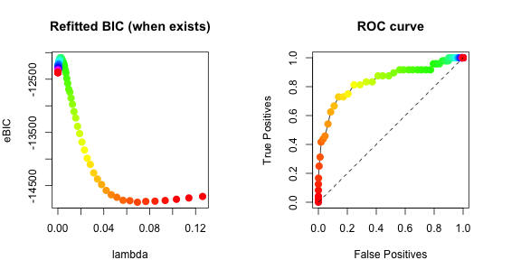
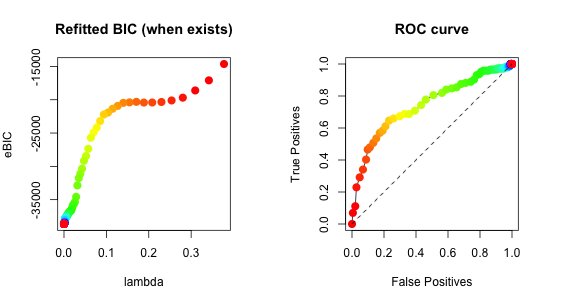

```r
library(genscore)
if (!requireNamespace("tmvtnorm", quietly = TRUE))
  stop("Please install package \"tmvtnorm\".")
library(tmvtnorm)
```
# Different domain types
The package offers a few types of domains on which the multivariate distribution is  defined, namely `"R"`, `"R+"`, `"uniform"`, `"simplex"`, and `"polynomial"`. As the domain is one of the two building blocks that define a distribution, we first present a guide to creating a `domain` object that should be passed to the two main functions `gen()` and `estimate()` (as the `domain` argument). 

Note that since the probability densities considered in the package are defined with respect to the Lebesgue measure, the package is indifferent to whether the boundary points are included in the domain or not (i.e. $\sum_ix_i^2<1$ and $\sum_ix_i^2\leq 1$ are treated equally), except for the simplex domains.

Throughout the demonstration in this section, we assume the number of covariates is `p=5.`

```r
p <- 5
```

## The entire real space
The most straightforward domain type is `"R"`, which is the entire real space $\mathbb{R}^p$.

```r
domain <- make_domain(type="R", p=p)
domain
#> $type
#> [1] "R"
#> 
#> $p
#> [1] 5
#> 
#> $p_deemed
#> [1] 5
#> 
#> $checked
#> [1] TRUE
```

## The non-negative orthant of the real space
The second most commonly used domain type would be the non-negative orthant of the $\mathbb{R}^p$ space, $\mathbb{R}_+^p$. Constructing the domain is also straightforward.

```r
domain <- make_domain(type="R+", p=p)
domain
#> $type
#> [1] "R+"
#> 
#> $p
#> [1] 5
#> 
#> $p_deemed
#> [1] 5
#> 
#> $checked
#> [1] TRUE
```

## The simplex domains
Another useful type of domains the package offers is the simplices. Formally, we define the $(p-1)$-dimensional simplex as $\{\boldsymbol{x}\in\mathbb{R}_+^p:\sum_{i=1}^p x_i=1, \boldsymbol{x}\succ\boldsymbol{0}\}$.

Defining the domain is also straightforward without any additional arguments required:

```r
domain <- make_domain(type="simplex", p=p)
domain
#> $type
#> [1] "simplex"
#> 
#> $p
#> [1] 5
#> 
#> $p_deemed
#> [1] 4
#> 
#> $checked
#> [1] TRUE
#> 
#> $simplex_tol
#> [1] 1e-10
```
The `simplex_tol` member is unique to this type of domain, and is used internally for checking if each row in the data matrix indeed sums to 1. It is also the only domain type that has `p_deemed` one less than `p`, whereas for other domain types these two are equal. It is because it is currently the only domain type implemented that is a Lebesgue-null subset of $\mathbb{R}^p$.

## Uniform-type domains
This domain type assumes that each component/covariate has the same domain, which is a finite union of intervals. The `lefts` arguments specify the left endpoints of each interval, and `rights` specify the right endpoints accordingly. Formally, the domain is defined as
$\left(\cup_{i}[\mathrm{lefts}_i,\mathrm{rights}_i]\right)^p$.

For example, if we assume each covariate is larger than (or equal to) 1, then one can specify the domain as follows.

```r
domain <- make_domain(type="uniform", p=p, lefts=1, rights=Inf)
domain
#> $type
#> [1] "uniform"
#> 
#> $p
#> [1] 5
#> 
#> $p_deemed
#> [1] 5
#> 
#> $lefts
#> [1] 1
#> 
#> $rights
#> [1] Inf
#> 
#> $left_inf
#> [1] FALSE
#> 
#> $right_inf
#> [1] TRUE
#> 
#> $checked
#> [1] TRUE
```
Note again that we do not differentiate between open/closed/half-open half-closed intervals, as the probability of the random vector lying at the boundary points is assumed to be 0.

If `rights` is just `Inf` and `lefts` is simply `-Inf` or `0`, this corresponds to the `"R"` and `"R+"` domain types, and the domain type would be changed accordingly.

```r
domain <- make_domain(type="uniform", p=p, lefts=-Inf, rights=Inf) # Changed to R
#> Warning in make_domain(type = "uniform", p = p, lefts = -Inf, rights = Inf):
#> Domain type automatically changed to R.
domain <- make_domain(type="uniform", p=p, lefts=0, rights=Inf) # Changed to R+
#> Warning in make_domain(type = "uniform", p = p, lefts = 0, rights = Inf): Domain
#> type automatically changed to R+.
```
Of course, the domain can also be bounded, e.g. $[-1,1]^p$.

```r
domain <- make_domain(type="uniform", p=p, lefts=-1, rights=1) 
domain
#> $type
#> [1] "uniform"
#> 
#> $p
#> [1] 5
#> 
#> $p_deemed
#> [1] 5
#> 
#> $lefts
#> [1] -1
#> 
#> $rights
#> [1] 1
#> 
#> $left_inf
#> [1] FALSE
#> 
#> $right_inf
#> [1] FALSE
#> 
#> $checked
#> [1] TRUE
```

A more interesting case would be when the uniform domain for each component is a union of multiple intervals, e.g. $((-\infty,-2]\cup[-1,1]\cup[2,+\infty))^p$.

```r
domain <- make_domain(type="uniform", p=p, lefts=c(-Inf, -1, 2), rights=c(-2, 1, Inf)) 
domain
#> $type
#> [1] "uniform"
#> 
#> $p
#> [1] 5
#> 
#> $p_deemed
#> [1] 5
#> 
#> $lefts
#> [1] -Inf   -1    2
#> 
#> $rights
#> [1]  -2   1 Inf
#> 
#> $left_inf
#> [1] TRUE
#> 
#> $right_inf
#> [1] TRUE
#> 
#> $checked
#> [1] TRUE
```

### Solution for infinite unions of intervals or non-uniform domains for each component
Domains that are a union of infinitely many intervals are currently not supported, but in some cases they can be approximated by a finite union. 

For example, if the goal is to generate samples using `gen()`, $\cup_{i=0}^{\infty}[2i,2i+1]$ may be approximated by $\cup_{i=0}^{10}[2i,2i+1]$ in the first three lines of code below, assuming the joint density is negligible if any $x_j>21$. 


```r
domain <- make_domain(type="uniform", p=p, lefts=seq(0, 20, by=2), rights=seq(1, 21, by=2)) # If goal is random sample generation, just truncate the infinite union by an interval large enough 
x <- gen(1000, setting="gaussian", abs=FALSE, eta=rep(0,p), K=diag(p), domain=domain, finite_infinity=100, seed=2, burn_in=1000, thinning=1000, verbose=FALSE, remove_outofbound=TRUE) # Generates a Gaussian
hist(x, breaks=20) # Generated data far from the upper bound 21 we set above
```


If the goal is estimation given a data matrix using `estimate()`, one may simply truncate the infinite union by $\left[-\max_{i,j}\left|x_{ij}\right|, \max_{i,j}\left|x_{ij}\right|\right]$, as below.

```r
# Suppose the goal is estimation, simply truncate to the maximum absolute value in x
max_i <- ceiling((max(abs(x)) - 1) / 2)
domain <- make_domain(type="uniform", p=p, lefts=seq(0, 2*max_i, by=2), rights=seq(1, 2*max_i+1, by=2))
# Estimate the inverse covariance matrix K with no penalty and no diagonal multiplier since n >> p, assuming mu = eta = 0
est <- estimate(x=x, setting="gaussian", domain=domain, centered = TRUE,
                mode="min_pow", param1=1, param2=3, lambda1s=0,
                diagonal_multiplier=1, verbose=FALSE, return_raw=TRUE)
est$raw_estimates[[1]] # Should be close to diag(p) we used to generate x
#>              [,1]        [,2]         [,3]         [,4]        [,5]
#> [1,]  1.037142623 -0.19835515 -0.003285077  0.258111089  0.06697515
#> [2,] -0.198355147  1.16963917 -0.096986651 -0.123145792  0.16352970
#> [3,] -0.003285077 -0.09698665  1.156527553 -0.009055624 -0.03244605
#> [4,]  0.258111089 -0.12314579 -0.009055624  1.267582275 -0.32215930
#> [5,]  0.066975147  0.16352970 -0.032446050 -0.322159301  0.84250419
```

If each covariate has its own domain as a different union of intervals, refer to the polynomial-type domains below.

## Polynomial-type domains
The most complicated and flexible domain type is `"polynomial"`. Although effort is made for simplifying the definition of this domain type, the user may find the exact rules/requirements confusing, but hopefully the examples should make it easier to follow.

Each polynomial-type domain is defined by a set of inequalities, where for each inequality a constant on the right-hand side is compared to a polynomial on the left-hand side, which must not have any interaction term and can have at most one term for each covariate. (That is, an inequality like $x_1x_2>1$ or $x_1^2+x_1^3>1$ are unfortunately not yet supported in the current version.) If there are more than one inequality, the user must specify a logical rule using `"&"` and `"|"` telling the program how to aggregate the domains defined by each inequality.

Each term can be $\log(x)$, $\exp(nx)$ with $n$ a nonzero integer, or a rational power of $x$, where $x^{a/b}=(-1)^a|x|^{a/b}$ ($a$, $b$ coprime) for $x\geq 0$ and $x<0$ if $b$ is odd, or `NA` if $x<0$ and $b$ is even.

For example, an inequality may look like $1.3x_1^2-2.7 x_2^3+0.37\exp(2x_3)-1.4\log(x_4)>1.3$, and another may look like $0.5x_1^{-2/3}+1.91x_2^{-5/4}-0.73\exp(-3x_3)-1.7\log(x_4)<-1.3$. If we wish to let our domain be the intersection of the two domains defined by the two inequalities, we write

```r
domain <- make_domain(type="polynomial", 
                      p=p,
                      rule="1 && 2",
                      ineqs=list(
                        list(expression="1.3x1^2-2.7* x2^3+0.37exp(2x3)-1.4log(x4)>1.3", 
                             nonnegative=FALSE, abs=FALSE),
                        list(expression="5e-1x1^(-2/3)+1.91*x2^(-5/4)-0.73exp(-3*x3)-1.7*log(x4)<-1.3",
                             nonnegative=FALSE, abs=FALSE)
                      )
)
domain
#> $type
#> [1] "polynomial"
#> 
#> $p
#> [1] 5
#> 
#> $p_deemed
#> [1] 5
#> 
#> $checked
#> [1] TRUE
#> 
#> $rule
#> [1] "1 && 2"
#> 
#> $ineqs
#> $ineqs[[1]]
#> $ineqs[[1]]$uniform
#> [1] FALSE
#> 
#> $ineqs[[1]]$larger
#> [1] TRUE
#> 
#> $ineqs[[1]]$power_numers
#> [1] 2 3 2 0 1
#> 
#> $ineqs[[1]]$power_denoms
#> [1] 1 1 0 0 1
#> 
#> $ineqs[[1]]$coeffs
#> [1]  1.30 -2.70  0.37 -1.40  0.00
#> 
#> $ineqs[[1]]$const
#> [1] 1.3
#> 
#> $ineqs[[1]]$abs
#> [1] FALSE
#> 
#> $ineqs[[1]]$nonnegative
#> [1] FALSE
#> 
#> 
#> $ineqs[[2]]
#> $ineqs[[2]]$uniform
#> [1] FALSE
#> 
#> $ineqs[[2]]$larger
#> [1] FALSE
#> 
#> $ineqs[[2]]$power_numers
#> [1] -2 -5 -3  0  1
#> 
#> $ineqs[[2]]$power_denoms
#> [1] 3 4 0 0 1
#> 
#> $ineqs[[2]]$coeffs
#> [1]  0.50  1.91 -0.73 -1.70  0.00
#> 
#> $ineqs[[2]]$const
#> [1] -1.3
#> 
#> $ineqs[[2]]$abs
#> [1] FALSE
#> 
#> $ineqs[[2]]$nonnegative
#> [1] FALSE
#> 
#> 
#> 
#> $postfix_rule
#> [1] "1 2 &"
```

### Inequalities
In this subsection we discuss the `ineqs` argument of `make_domain()` when defining a polynomial-type domain.

The argument must be a list, and each element in this list is a list itself that represents an inequality. The recommended way of representing an inequality uses a  list of three members: (1) `nonnegative`, a logical indicating whether the domain of this inequality should be restricted to $\mathbb{R}_+^p$, (2) `abs`, a logical whether to use the absolute values $|\boldsymbol{x}|$ in place of $\boldsymbol{x}$ when evaluating the inequality, and (3) `expression`, a string expression of the inequality, which we explain the next. There is another highly discouraged way of representing an inequality by how the inequality is stored internally that is not covered in this guide.

We call a term in an expression "uniform" if it is written as a function in "x", and "non-uniform" if it is written as a function in "x" followed by an index, e.g. "x1" or "x2". A uniform term can be (1) `"log(x)"`, (2) `"exp(x)"`, `"exp(nx)"` or `"exp(n*x)"` where `n` is a nonzero integer, or (3) a power in one of the following forms: `"x^n"`, `"x^(-n)"`, `"x^(n/m)"`, `"x^(-n/m)"`, `"x^(n/-m)"` (replace `n` and `m` by non-zero integers). A non-uniform term is similar (replacing `x` by e.g. `x1` or `x2`), and can start with a coefficient, e.g. `"1.2*log(x)"`, `"-2.3x^2"`.

An `expression` must have the variable part on the left-hand side, followed by one of  "<", ">", "<=", ">=", and finally a number to compare to. The variable part can be (1) a single uniform term (e.g. `x^(-2/3)`, `exp(x)`, `log(x)`), (2) a single uniform term surrounded by `"sum()"` (e.g. `sum(x^(-2/3))`, `sum(exp(x))`, `sum(log(x))`), or (3) a sum of non-uniform terms separated by `+`/`-` (e.g. `1.3x1^2-0.7*x2^(2/3)+2e3log(x)+1.3e-2*exp(-x)`).

For (1), the same inequality will be applied to each covariate independently; (2) on the other hand is a shorthand for (3) with the same form for all components and coefficients all equal to 1 (e.g. `"sum(x^2)"` is just `"x1^2+x2^2+...+xp^2"`).

In conclusion, the following are some examples of `expression`:

```r
"x<=-3.2e2" # (1)
#> [1] "x<=-3.2e2"
"x^(-2/3)>3.1" # (1)
#> [1] "x^(-2/3)>3.1"
"exp(x)>1.3" # (1)
#> [1] "exp(x)>1.3"
"exp(-23x)<=3e3" # (1)
#> [1] "exp(-23x)<=3e3"
"log(x) < 1.3" # (1)
#> [1] "log(x) < 1.3"
"sum(x)<=3e3" # (2)
#> [1] "sum(x)<=3e3"
"sum(x^2)>10" # (2)
#> [1] "sum(x^2)>10"
"sum(x^(1/3))>10" # (2)
#> [1] "sum(x^(1/3))>10"
"sum(x^(-2/3))<=3e3" # (2)
#> [1] "sum(x^(-2/3))<=3e3"
"sum(exp(-23x))<=3e3" # (2)
#> [1] "sum(exp(-23x))<=3e3"
"sum(log(x)) < 2" # (2)
#> [1] "sum(log(x)) < 2"
"x1>1" # (3)
#> [1] "x1>1"
"x2<=1" # (3)
#> [1] "x2<=1"
"x1^(2/3)-1.3x2^(-3)< 1" # (3)
#> [1] "x1^(2/3)-1.3x2^(-3)< 1"
"exp(x1)+2.3*x2^2 > 2" # (3)
#> [1] "exp(x1)+2.3*x2^2 > 2"
"1x1+2x2+3x3+4x4+5x5 <1" # (3)
#> [1] "1x1+2x2+3x3+4x4+5x5 <1"
"0.5*x1^(-2/3)-0.3x4^(4/-6)+2e3x3^(-6/9) < 3.5e5" # (3)
#> [1] "0.5*x1^(-2/3)-0.3x4^(4/-6)+2e3x3^(-6/9) < 3.5e5"
"0.5*x1^(-2/3)-x3^3 + 2log(x2)- 1.3e4exp(-25*x6)+x8-.3x5^(-3/-4) >= 2" # (3)
#> [1] "0.5*x1^(-2/3)-x3^3 + 2log(x2)- 1.3e4exp(-25*x6)+x8-.3x5^(-3/-4) >= 2"
```

### Rule
If more than one inequality is provided, the user must specify the rule to aggregate the domains defined by each function. The rule can only contain inequality numbers (indexed starting from 1 to `length(domain$ineqs)`), logical operators (`&` / `|`, or `&&` / `||`; no difference is made between the single and doubled operators), parentheses and space. The only other requirement is that `&` and `|` is given the same precedence, and thus only operators of the same kind can be chained without a parenthesis, i.e. `1 & 2 | 3` is not allowed; one must specify `(1 & 2) | 3` or `1 | (2 & 3)` to avoid ambiguity. The following are some rules allowed.

```r
"1"
#> [1] "1"
"1 & 2" # Assuming there are at least 2 inequalities
#> [1] "1 & 2"
"1 || 2" # Assuming >= 2 inequalities
#> [1] "1 || 2"
"1 && 2 & 3" # Assuming >= 3 inequalities
#> [1] "1 && 2 & 3"
"1 | 2 || 3" # Assuming >= 3 inequalities
#> [1] "1 | 2 || 3"
"(((1 & 2) | (3 & 4 && 5) || 6 || 7) & 8 & 9 && 10) || 11 " # Assuming >= 11 inequalities
#> [1] "(((1 & 2) | (3 & 4 && 5) || 6 || 7) & 8 & 9 && 10) || 11 "
```

### Examples of polynomial domains

```r
# x such that sum(x^2) > 10 && sum(x^(1/3)) > 10 with x allowed to be negative
domain <- make_domain("polynomial", p=p, rule="1 && 2",
                      ineqs=list(list(expression="sum(x^2)>10", abs=FALSE, nonnegative=FALSE),
                                 list(expression="sum(x^(1/3))>10", abs=FALSE, nonnegative=FALSE)))

# x such that {x1 > 1 && log(1.3) < x2 < 1 && x3 > log(1.3) && ... && xp > log(1.3)}
domain <- make_domain("polynomial", p=p, rule="1 && 2 && 3",
                      ineqs=list(list(expression="x1>1", abs=FALSE, nonnegative=TRUE),
                                 list(expression="x2<1", abs=FALSE, nonnegative=TRUE),
                                 list(expression="exp(x)>1.3", abs=FALSE, nonnegative=FALSE)))

#' # x in R_+^p such that {sum(log(x))<2 || (x1^(2/3)-1.3x2^(-3)<1 && exp(x1)+2.3*x2>2)}
domain <- make_domain("polynomial", p=p, rule="1 || (2 && 3)",
                      ineqs=list(list(expression="sum(log(x))<2", abs=FALSE, nonnegative=TRUE),
                                 list(expression="x1^(2/3)-1.3x2^(-3)<1", abs=FALSE, nonnegative=TRUE),
                                 list(expression="exp(x1)+2.3*x2^2>2", abs=FALSE, nonnegative=TRUE)))

#' # x in R_+^p such that {x in R_+^p: sum_j j * xj <= 1}
domain <- make_domain("polynomial", p=p,
                      ineqs=list(
                        list(expression=paste(paste(sapply(1:p, function(j){paste(j, "x", j, sep="")}), collapse="+"), "<1"),
                             abs=FALSE, nonnegative=TRUE)))

# The l-1 ball {sum(|x|) < 1}
domain <- make_domain("polynomial", p=p, 
                      ineqs=list(list(expression="sum(x)<1", abs=TRUE, nonnegative=FALSE)))
```

# Distribution Models Supported
This package assumes the densities are with respect to the Lebesgue measure, from the exponential family and form interaction graphical models, proportional to
\[\exp\left\{-\frac{1}{2a}{\boldsymbol{x}^a}^{\top}\mathbf{K}\boldsymbol{x}^a+\frac{1}{b}\boldsymbol{\eta}^{\top}\boldsymbol{x}^b\right\},\]
where `a=a_numer/a_denom` and `b=b_numer/b_denom` with `a_numer`, `a_denom`, `b_numer`, `b_denom` are integers. We define
$\frac{1}{(0/0)}\boldsymbol{x}^{0/0}\equiv\log\boldsymbol{x}$ and $\frac{1}{(n/0)}\boldsymbol{x}^{n/0}\equiv\exp(n\boldsymbol{x})$ for $n\neq 0$ (the $\exp$ case has been implemented for `gen()` but not yet for `estimate()` and thus has no name). 

Note that $\mathbf{K}$ is generally assumed to be positive definite (except for the Aitchison $A^d$ model, `"log_log_sum0"` explained below). If $b$ is $0/0$ (i.e. $\boldsymbol{\eta}^{\top}\log(\boldsymbol{x})$ appears in the log density), $\boldsymbol{\eta}\succ-1$ is necessary for the density to have a finite normalizing constant.

When generating random samples using `gen()` or doing estimation using `estimate()`, you should specify the model by passing its name as the `setting` argument.

For example, the Gaussian graphical models have name `"gaussian"` with density proportional to
\[\exp\left\{-\frac{1}{2}{\boldsymbol{x}}^{\top}\mathbf{K}\boldsymbol{x}+\boldsymbol{\eta}^{\top}\boldsymbol{x}\right\};\]
the square root exponential graphical models from Inouye et al. (2016) and Yu et al. (2019) have name `"exp"` with density proportional to
\[\exp\left\{-{\boldsymbol{x}^{1/2}}^{\top}\mathbf{K}\boldsymbol{x}^{1/2}+2\boldsymbol{\eta}^{\top}\boldsymbol{x}^{1/2}\right\};\]
the gamma graphical models from Yu et al. (2019) have name `"gamma"` with density proportional to
\[\exp\left\{-{\boldsymbol{x}^{1/2}}^{\top}\mathbf{K}\boldsymbol{x}^{1/2}+\boldsymbol{\eta}^{\top}\log(\boldsymbol{x})\right\};\]
the $A^d$ model on the simplex from Aitchison (1985) have name `"log_log_sum0"` with density proportional to
\[\exp\left\{-\frac{1}{2}\log(\boldsymbol{x})^{\top}\mathbf{K}\log(\boldsymbol{x})+\boldsymbol{\eta}^{\top}\log(\boldsymbol{x})\right\}\]
where $\mathbf{K}\boldsymbol{1}=\mathbf{K}^{\top}\boldsymbol{1}=\boldsymbol{0}$. If we do not assume the rows and columns sum to 0, the setting has name `"log_log"`.

For models with other $a$ and $b$, their names should have the form `"ab_aVal_bVal"` with `aVal` and `bVal` both integers or both two integers separated by `"/"`, e.g. `"ab_2_2"` if $a=b=2$, or `"ab_2_5/4"` if $a=2$ and $b=5/4$, or `"ab_2/3_1/2"` if $a=2/3$ and $b=1/2$.

# Examples of Multivariate Graphical Models
In this section we show how to use the package to generate random samples from interaction models defined on a type of domain already implemented. We focus on  the canonical example of the `"R+"` domain, namely the non-negative orthant $\mathbb{R}_+^p$. Examples of Aitchison (1985) models on the $(p-1)$-dimensional simplex would then follow.

## Truncated Gaussian Graphical Models on the Non-negative Orthant
### Data setup
We begin by generating a mean parameter and an inverse covariance matrix, and taking the true edge set.

```r
n <- 200
p <- 50
tol <- 1e-8
domain <- make_domain(type="R+", p=p)
mu <- rnorm(p) * 0.5
K <- cov_cons(mode="sub", p=p, seed=1, spars=0.2, eig=0.1, subgraphs=5)
true_edges <- which(abs(K) > tol & diag(p) == 0)
```
Next, we generate a sample from the truncated Gaussian distribution with parameters generated above.

```r
set.seed(1)
x <- rtmvnorm(n, mean = mu, sigma = solve(K), lower = rep(0, p), upper = rep(Inf, p), algorithm = "gibbs", burn.in.samples = 100, thinning = 10)
```
### Estimation using `estimate()` with `x` directly
We can obtain a path of estimated graphs over a grid of lambdas using a number of different ways. The simplest and the most convenient way would be to call the `estimate()` function. First suppose that in our estimation we use $h(x)=\min(x,3)$ and the "high" diagonal multiplier defined in Yu et al (2019). For simplicity we use the profiled estimator (lambda_eta = 0, `lambda_ratio=Inf`), but we remind that as shown in Yu et al (2019) using a reasonable `lambda_ratio` would significantly improve the result.

```r
maxit <- 1000
nlambda <- 100
dm <- 1 + (1-1/(1+4*exp(1)*max(6*log(p)/n, sqrt(6*log(p)/n)))) # diagonal multiplier
h_mode <- "min_pow"
h_param1 <- 1
h_param2 <- 3
est <- estimate(x, setting="gaussian", domain=domain, centered=FALSE, symmetric="symmetric", scale="norm", lambda_length=nlambda, lambda_ratio=Inf, mode=h_mode, param1=h_param1, param2=h_param2, verbose=FALSE, tol=tol, maxit=maxit, BIC_refit=TRUE, diagonal_multiplier=dm, return_raw=TRUE)
```
The results returned contain a list of edge sets, `edgess`, one for each lambda.

```r
est$edgess[[1]] # empty graph
#> integer(0)
length(est$edgess[[nlambda]]) == p*(p-1) # complete graph
#> [1] TRUE
length(est$edgess[[nlambda/2]]) # estimated graph for the 50th lambda
#> [1] 2388
```
The result ```est``` also includes a matrix `BIC` containing the eBIC values, and `BIC_refits` if run with `BIC_refit=TRUE`. Each column corresponds to the choice of $\gamma=0,0.5,1$; c.f. Chen and Chen (2008).

```r
est$BICs[1:10,]
#>             [,1]       [,2]      [,3]
#>  [1,] -445.29295 -445.29295 -445.2929
#>  [2,] -408.37424 -367.14170 -325.9092
#>  [3,] -340.62780 -240.90543 -141.1831
#>  [4,] -237.98286  -64.51935  108.9442
#>  [5,] -159.50277   65.06685  289.6365
#>  [6,]  -25.86317  274.58896  575.0411
#>  [7,]  136.03505  516.53831  897.0416
#>  [8,]  325.88246  787.68786 1249.4933
#>  [9,]  538.26160 1078.32728 1618.3930
#> [10,]  805.11502 1426.80810 2048.5012
est$BIC_refits[1:10, ]
#>            [,1]      [,2]      [,3]
#>  [1,] -2101.744 -2101.744 -2101.744
#>  [2,] -2345.880 -2304.647 -2263.415
#>  [3,] -2651.017 -2551.294 -2451.572
#>  [4,] -2964.166 -2790.702 -2617.239
#>  [5,] -3193.223 -2968.654 -2744.084
#>  [6,] -3535.282 -3234.830 -2934.378
#>  [7,] -3866.533 -3486.029 -3105.526
#>  [8,] -4170.900 -3709.095 -3247.290
#>  [9,] -4422.488 -3882.422 -3342.357
#> [10,] -4654.398 -4032.705 -3411.012
```
We can also take a look at the lambda values we used in the estimation. We only specified the number of lambdas to ```lambda_length=100```, and the lambda values are automatically generated by the function.

```r
est$lambda1s # lambda_Ks used
#>   [1] 1.305613e-01 1.181263e-01 1.068757e-01 9.669654e-02 8.748692e-02
#>   [6] 7.915445e-02 7.161558e-02 6.479473e-02 5.862351e-02 5.304006e-02
#>  [11] 4.798839e-02 4.341786e-02 3.928263e-02 3.554125e-02 3.215621e-02
#>  [16] 2.909357e-02 2.632263e-02 2.381560e-02 2.154734e-02 1.949511e-02
#>  [21] 1.763835e-02 1.595843e-02 1.443851e-02 1.306335e-02 1.181916e-02
#>  [26] 1.069348e-02 9.675001e-03 8.753530e-03 7.919822e-03 7.165518e-03
#>  [31] 6.483056e-03 5.865593e-03 5.306939e-03 4.801493e-03 4.344186e-03
#>  [36] 3.930435e-03 3.556091e-03 3.217400e-03 2.910966e-03 2.633718e-03
#>  [41] 2.382876e-03 2.155925e-03 1.950589e-03 1.764810e-03 1.596725e-03
#>  [46] 1.444649e-03 1.307057e-03 1.182570e-03 1.069939e-03 9.680351e-04
#>  [51] 8.758370e-04 7.924201e-04 7.169480e-04 6.486641e-04 5.868836e-04
#>  [56] 5.309874e-04 4.804148e-04 4.346589e-04 3.932609e-04 3.558057e-04
#>  [61] 3.219179e-04 2.912576e-04 2.635175e-04 2.384194e-04 2.157117e-04
#>  [66] 1.951668e-04 1.765786e-04 1.597608e-04 1.445448e-04 1.307780e-04
#>  [71] 1.183224e-04 1.070530e-04 9.685704e-05 8.763213e-05 7.928583e-05
#>  [76] 7.173444e-05 6.490227e-05 5.872082e-05 5.312810e-05 4.806804e-05
#>  [81] 4.348992e-05 3.934783e-05 3.560024e-05 3.220959e-05 2.914186e-05
#>  [86] 2.636632e-05 2.385512e-05 2.158310e-05 1.952747e-05 1.766763e-05
#>  [91] 1.598492e-05 1.446247e-05 1.308503e-05 1.183878e-05 1.071122e-05
#>  [96] 9.691060e-06 8.768059e-06 7.932967e-06 7.177411e-06 6.493816e-06
est$lambda2s # lambda_etas, all 0 since with lambda_ratio=Inf we are in the profiled setting
#>   [1] 0 0 0 0 0 0 0 0 0 0 0 0 0 0 0 0 0 0 0 0 0 0 0 0 0 0 0 0 0 0 0 0 0 0 0 0 0
#>  [38] 0 0 0 0 0 0 0 0 0 0 0 0 0 0 0 0 0 0 0 0 0 0 0 0 0 0 0 0 0 0 0 0 0 0 0 0 0
#>  [75] 0 0 0 0 0 0 0 0 0 0 0 0 0 0 0 0 0 0 0 0 0 0 0 0 0 0
```
If run with `centered=FALSE`, `etas` is also returned. The raw estimates of K are stored in `raw_estimates` if `return_raw=TRUE` in the function call.

```r
est$etas[1:5,1:5] # First 5 components for the first 5 lambdas
#>           [,1]       [,2]      [,3]      [,4]      [,5]
#> [1,] -1.233783 -0.8367694 -1.124133 -1.523860 -1.213421
#> [2,] -1.233783 -0.8367694 -1.124844 -1.523860 -1.214110
#> [3,] -1.233783 -0.8367694 -1.132828 -1.525857 -1.208743
#> [4,] -1.233783 -0.8367694 -1.147555 -1.531046 -1.191121
#> [5,] -1.235740 -0.8367694 -1.160732 -1.536887 -1.170514
est$raw_estimates[[nlambda/2]][1:5,1:5] # First few entries of the estimated K for the 50th lambda
#>             [,1]        [,2]        [,3]         [,4]        [,5]
#> [1,]  0.11276236 -0.04158900 -0.03624884  0.036769531  0.07729333
#> [2,] -0.04158900  0.33835651 -0.06945853 -0.047081226  0.02482866
#> [3,] -0.03624884 -0.06945853  0.16939438 -0.031710551 -0.10068159
#> [4,]  0.03676953 -0.04708123 -0.03171055  0.002637566  0.07725902
#> [5,]  0.07729333  0.02482866 -0.10068159  0.077259018  0.13069943
```
Here we plot the refitted BIC versus lambda curve and the ROC curve. Note that points with the same color in both graphs correspond to the same lambda.

```r
ROC <- t(sapply(est$edgess, tp_fp, true_edges=true_edges, p=p)) # ROC curve
AUC(ROC) # The area under the curve
#> [1] 0.6750035
par(mfrow=c(1,2), mar=c(4,4,4,4))
colors_ <- rainbow(nlambda)
plot_BIC_ind <- !is.infinite(est$BIC_refits[,3])
plot(est$lambda1s[plot_BIC_ind], est$BIC_refits[plot_BIC_ind,3], col=colors_[plot_BIC_ind], pch=16, cex=1.5, xlab="lambda", ylab="eBIC", main="Refitted BIC (when exists)")
plot(c(),c(), ylim = c(0,1), xlim = c(0,1), cex.lab=1, xlab = "False Positives", ylab = "True Positives", main = "ROC curve")
points(ROC[,2], ROC[,1], type="l")
points(ROC[,2], ROC[,1], pch=16, cex=1.5, col=colors_)
points(c(0,1), c(0,1), type="l", lty=2)
```


### Estimate using `elts`
The function `estimate()` internally calls `get_elts()`, which calculates summary statistics (`elts`) of `x` used for estimation. If one were to rerun `estimate()` a multiple of times, e.g. when trying out different h functions, it might be time-saving to calculate these elements using `get_elts()` first, and then call `estimate()` with these elements directly, as shown in the following example. Unlike `estimate()` which may take the name of the function family and the parameters of h as inputs, `get_elts()` takes the h function and its derivative (`hp`) explicitly. We may obtain these through `get_h_hp()`.

```r
h_hp <- get_h_hp(mode=h_mode, para=h_param1, para2=h_param2) # h(x)=min(x,3), h'(x)=(x<=3)
elts_P <- get_elts(h_hp, x, setting="gaussian", domain=domain, centered=FALSE, profiled_if_noncenter=Inf, scale="norm", diagonal_multiplier=dm, use_C=TRUE, tol=tol) # P stands for Profiled
```
We can then feed `elts_P` into `estimate()` to avoid recalculation of the summary statistics. Note that here since we have already defined the `h` and `hp` directly, we can pass them to `estimate()` instead of passing `mode`, `param1` and `param2`, in which case `estimate()` internally calls `get_h_hp()` just as we did. Now the results should be the same as `est` that we obtained before.

```r
est2 <- estimate(x, setting="gaussian", domain=domain, elts=elts_P, centered=FALSE, symmetric="symmetric", scale="norm", lambda_length=nlambda, lambda_ratio=Inf, h_hp=h_hp, verbose=FALSE, tol=tol, maxit=maxit, BIC_refit=TRUE, diagonal_multiplier=dm,  return_raw=TRUE)
compare_two_results(est, est2) ## Should be all close to 0
#>     edgess       BICs          K   lambda1s   lambda2s       etas BIC_refits 
#>          0          0          0          0          0          0          0
```
### Results for one lambda
It may be convenient to have a function that estimates the graph for one specific lambda. The function `get_results()` is useful in this case.

```r
i <- 10
# Re-estimate at the 10th lambda
lambda1 <- est$lambda1s[i]
sub_res <- get_results(elts_P, symmetric="symmetric", lambda1=lambda1, lambda2=0, tol=tol, maxit=maxit, previous_res=NULL, is_refit=FALSE)
# Check if the result matches the previous one
sum(abs(est$raw_estimates[[i]] - sub_res$K))
#> [1] 1.500903e-10
sum(abs(est$etas[i,] - sub_res$eta))
#> [1] 4.394796e-11
all(sub_res$edges == est$edgess[[i]])
#> [1] TRUE
```
Equivalently, we can use `estimate()` with one lambda value (optionally with `elts_P` if available).

```r
est_sub <- estimate(x, setting="gaussian", domain=domain, centered=FALSE, symmetric="symmetric", scale="norm", lambda1s = lambda1, lambda_ratio=Inf, mode=h_mode, param1=h_param1, param2=h_param2, verbose=FALSE, tol=tol, maxit=maxit, BIC_refit=TRUE, diagonal_multiplier=dm,  return_raw=TRUE)
# Check if the result matches the previous one
sum(abs(est_sub$raw_estimates[[1]] - sub_res$K))
#> [1] 0
sum(abs(est_sub$etas[1,] - sub_res$eta))
#> [1] 0
all(est_sub$edgess[[1]] == est$edgess[[1]])
#> [1] TRUE
```
The same function can also be used for fitting an unpenalized model restricted to a specific edge set when e.g. calculating the refitted eBIC by restricting to the estimated edge set. One can thus manually calculate the refitted eBIC in this manner, but we encourage using the function wrapper `estimate()` directly, which produces this information automatically.

```r
est_refit <- get_results(elts_P, symmetric="symmetric", lambda1=lambda1, lambda2=0, tol=tol, maxit=maxit, previous_res=sub_res, is_refit=TRUE)
# Manually calculate the BIC score (eBIC with gamma = 0)
2*n*est_refit$crit + (length(est_refit$edges)/2+length(est_refit$eta_support))*log(n)
#> [1] -4654.398
# Should match the number returned previously by estimate()
est$BIC_refit[i,1]
#> [1] -4654.398
```
### Aggregating multiple ROC curves
The `avgrocs()` function aggregates multiple ROC curves using vertical averaging by adopting algorithm 3 from Fawcett (2006). Here is a quick example.

```r
ROCs <- NULL
par(mfrow=c(2,2), mar=c(3,3,3,3))
for (i in 1:3){
  set.seed(i)
  x <- rtmvnorm(n, mean = mu, sigma = solve(K), lower = rep(0, p), upper = rep(Inf, p), algorithm = "gibbs", burn.in.samples = 100, thinning = 10)
  est <- estimate(x, setting="gaussian", domain=domain, centered=FALSE, symmetric="symmetric", scale="norm", lambda_length=nlambda, lambda_ratio=Inf, mode=h_mode, param1=h_param1, param2=h_param2, verbose=FALSE, tol=tol, maxit=maxit, BIC_refit=FALSE, diagonal_multiplier=dm, return_raw=FALSE)
  ROC <- t(sapply(est$edgess, function(edges){tp_fp(edges, true_edges, p)}))
  ROCs[[i]] <- ROC
  plot(c(), c(),  ylim=c(0,1), xlim=c(0,1), cex.lab=1, main=paste("ROC, trial ",i,", AUC ",round(AUC(ROC),4),sep=""), xlab="False Positives", ylab="True Positives")
  points(ROC[,2], ROC[,1], type="l")
  points(c(0,1), c(0,1), type = "l", lty = 2)
}
average_ROC <- avgrocs(ROCs, length(true_edges), p)
plot(c(), c(),  ylim=c(0,1), xlim=c(0,1), cex.lab=1, main=paste("Average ROC, AUC",round(AUC(average_ROC),4)), xlab="False Positives", ylab="True Positives")
points(average_ROC[,2], average_ROC[,1], type="l")
points(c(0,1), c(0,1), type = "l", lty = 2)
```


## Exponential Square-Root Graphical Models on the Non-negative Orthant
### Data setup
Consider the exponential square-root graphical models from Inouye et al (2016) on $\mathbb{R}_+^p$, which is also defined as a special case of the a-b model in (1) in Yu et al (2019) with $a=b=0.5$. We reuse the mean and inverse covariance matrix parameters from the previous section, and generate a new sample from the exponential square-root distribution.

```r
x <- gen(n, setting="exp", abs=FALSE, eta=mu, K=K, domain=domain, finite_infinity=100, seed=2, burn_in=1000, thinning=1000, verbose=FALSE, remove_outofbound=TRUE)
```
### Estimation
As suggested by the simulation studies in Yu et al (2019), we estimate using $h(x)=\min(x,3)^{1.5}$. We also try with a finite `lambda_ratio` as it is known to improve the result compared to the profiled estimator, although the best ratio is subject to careful tuning.

```r
h_mode <- "min_pow"
h_param1 <- 1.5
h_param2 <- 3
est_exp <- estimate(x, setting="exp", domain=domain, centered=FALSE, symmetric="symmetric", scale="norm", lambda_length=nlambda, lambda_ratio=2, mode=h_mode, param1=h_param1, param2=h_param2, verbose=FALSE, tol=tol, maxit=maxit, BIC_refit=TRUE, diagonal_multiplier=dm,  return_raw=FALSE)
ROC_exp <- t(sapply(est_exp$edgess, tp_fp, true_edges=true_edges, p=p)) # ROC curve
AUC(ROC_exp) # The area under the curve
#> [1] 0.8418207
par(mfrow=c(1,2), mar=c(4,4,4,4))
plot_BIC_ind <- !is.infinite(est_exp$BIC_refits[,3])
plot(est_exp$lambda1s[plot_BIC_ind], est_exp$BIC_refits[plot_BIC_ind,3], col=colors_[plot_BIC_ind], pch=16, cex=1.5, xlab="lambda", ylab="eBIC", main="Refitted BIC (when exists)")
plot(c(),c(), ylim = c(0,1), xlim = c(0,1), cex.lab=1, xlab = "False Positives", ylab = "True Positives", main = "ROC curve")
points(ROC_exp[,2], ROC_exp[,1], type="l")
points(ROC_exp[,2], ROC_exp[,1], pch=16, cex=1.5, col=colors_)
points(c(0,1), c(0,1), type="l", lty=2)
```



## Gamma Graphical Models on the Non-negative Orthant
We now try the same experiments with the gamma models ($a=0.5$, $b=0$) on $\mathbb{R}_+^p$, again with $h(x)=\min(x,3)^{1.5}$ and `lambda_ratio=2`. However, recall that the gamma graphical models require all entries in the linear parameter to be strictly larger than -1.

```r
mu[mu <= -1] <- abs(mu[mu <= -1]) # make sure all entries are strictly larger than 1
x <- gen(n, setting="gamma", abs=FALSE, eta=mu, K=K, domain=domain, finite_infinity=100, seed=3, burn_in=1000, thinning=1000, verbose=FALSE, remove_outofbound=TRUE)
h_mode <- "min_pow"
h_param1 <- 1.5
h_param2 <- 3
est_gamma <- estimate(x, setting="gamma", domain=domain, centered=FALSE, symmetric="symmetric", scale="norm", lambda_length=nlambda, lambda_ratio=2, mode=h_mode, param1=h_param1, param2=h_param2, verbose=FALSE, tol=tol, maxit=maxit, BIC_refit=TRUE, diagonal_multiplier=dm,  return_raw=FALSE)
ROC_gamma <- t(sapply(est_gamma$edgess, tp_fp, true_edges=true_edges, p=p)) # ROC curve
AUC(ROC_gamma) # The area under the curve
#> [1] 0.6860751
par(mfrow=c(1,2), mar=c(4,4,4,4))
plot_BIC_ind <- !is.infinite(est_gamma$BIC_refits[,3])
plot(est_gamma$lambda1s[plot_BIC_ind], est_gamma$BIC_refits[plot_BIC_ind,3], col=colors_[plot_BIC_ind], pch=16, cex=1.5, xlab="lambda", ylab="eBIC", main="Refitted BIC (when exists)")
plot(c(),c(), ylim = c(0,1), xlim = c(0,1), cex.lab=1, xlab = "False Positives", ylab = "True Positives", main = "ROC curve")
points(ROC_gamma[,2], ROC_gamma[,1], type="l")
points(ROC_gamma[,2], ROC_gamma[,1], pch=16, cex=1.5, col=colors_)
points(c(0,1), c(0,1), type="l", lty=2)
```


## General a-b Graphical Models on the Non-negative Orthant
The same can be applied to models with a general choice of $a$ and $b$. We now experiment with $a=1.5$, $b=0.5$ on $\mathbb{R}_+^p$, and estimate using $h(x)=\min(x,3)^{1/2}$ and `lambda_ratio=2`.

```r
x <- gen(n, setting="ab_3/2_1/2", abs=FALSE, eta=mu, K=K, domain=domain, finite_infinity=100, seed=4, burn_in=1000, thinning=1000, verbose=FALSE, remove_outofbound=TRUE)
h_mode <- "min_pow"
h_param1 <- 0.5
h_param2 <- 3
est_ab <- estimate(x, setting="ab_3/2_1/2", domain=domain, centered=FALSE, symmetric="symmetric", scale="norm", lambda_length=nlambda, lambda_ratio=2, mode=h_mode, param1=h_param1, param2=h_param2, verbose=FALSE, tol=tol, maxit=maxit, BIC_refit=TRUE, diagonal_multiplier=dm,  return_raw=FALSE)
ROC_ab <- t(sapply(est_ab$edgess, tp_fp, true_edges=true_edges, p=p)) # ROC curve
AUC(ROC_ab) # The area under the curve
#> [1] 0.8145798
par(mfrow=c(1,2), mar=c(4,4,4,4))
plot_BIC_ind <- !is.infinite(est_ab$BIC_refits[,3])
plot(est_ab$lambda1s[plot_BIC_ind], est_ab$BIC_refits[plot_BIC_ind,3], col=colors_[plot_BIC_ind], pch=16, cex=1.5, xlab="lambda", ylab="eBIC", main="Refitted BIC (when exists)")
plot(c(),c(), ylim = c(0,1), xlim = c(0,1), cex.lab=1, xlab = "False Positives", ylab = "True Positives", main = "ROC curve")
points(ROC_ab[,2], ROC_ab[,1], type="l")
points(ROC_ab[,2], ROC_ab[,1], pch=16, cex=1.5, col=colors_)
points(c(0,1), c(0,1), type="l", lty=2)
```


## (Untruncated) Gaussian Graphical Models on the Entire Real Space
By specifying an `"R"` type domain, the package also includes implementations for estimating the inverse covariance matrix from Gaussian graphical models on the entire $R^p$. However, for Gaussian graphical models we use the penalized version of the original score matching from Hyv\"arinen (2005); see Lin et al (2016). Thus, the `h` and `hp` functions are ignored (where we fix $h(x)=1$), and the summary statistics (`elts`) are stored internally in a different way. Below we show an example where we draw samples using the same mean and inverse covariance matrix as before, and estimate with `lambda_ratio=2`.

```r
domain <- make_domain("R", p=p)
set.seed(5)
x <- rmvnorm(n, mean = mu, sigma = solve(K))
est_gauss <- estimate(x, setting="gaussian", domain=domain, centered=FALSE, symmetric="symmetric", scale="norm", lambda_length=nlambda, lambda_ratio=2, verbose=FALSE, tol=tol, maxit=maxit, BIC_refit=TRUE, diagonal_multiplier=dm,  return_raw=TRUE)
```
Alternatively, get the summary statistics first (without specifying `h` and `hp`) and pass it to `estimate()`.

```r
elts_gauss <- get_elts(NULL, x, setting="gaussian", domain=domain, centered=FALSE, profiled_if_noncenter=FALSE, scale="norm", diagonal_multiplier=dm, use_C=TRUE, tol=tol)
est_gauss2 <- estimate(x, setting="gaussian", elts=elts_gauss, domain=domain, centered=FALSE, symmetric="symmetric", scale="norm", lambda_length=nlambda, lambda_ratio=2, verbose=FALSE, tol=tol, maxit=maxit, BIC_refit=TRUE, diagonal_multiplier=dm,  return_raw=TRUE)
compare_two_results(est_gauss, est_gauss2) ## Should be all close to 0
#>     edgess       BICs          K   lambda1s   lambda2s       etas BIC_refits 
#>          0          0          0          0          0          0          0
```
We can then draw the ROC curve as before.

```r
ROC_gauss <- t(sapply(est_gauss$edgess, tp_fp, true_edges=true_edges, p=p)) # ROC curve
AUC(ROC_gauss) # The area under the curve
#> [1] 0.9815651
par(mfrow=c(1,2), mar=c(4,4,4,4))
plot_BIC_ind <- !is.infinite(est_gauss$BIC_refits[,3])
plot(est_gauss$lambda1s[plot_BIC_ind], est_gauss$BIC_refits[plot_BIC_ind,3], col=colors_[plot_BIC_ind], pch=16, cex=1.5, xlab="lambda", ylab="eBIC", main="Refitted BIC (when exists)")
plot(c(),c(), ylim = c(0,1), xlim = c(0,1), cex.lab=1, xlab = "False Positives", ylab = "True Positives", main = "ROC curve")
points(ROC_gauss[,2], ROC_gauss[,1], type="l")
points(ROC_gauss[,2], ROC_gauss[,1], pch=16, cex=1.5, col=colors_)
points(c(0,1), c(0,1), type="l", lty=2)
```


## Aitchison $A^d$ Models on the Simplex
The last interesting multivariate model we present is the $A^d$ model from Aitchison (1985) with density on the $(p-1)$-dimensional simplex proportional to
\[\exp\left\{-\frac{1}{2}\log(\boldsymbol{x})^{\top}\mathbf{K}\log(\boldsymbol{x})+\boldsymbol{\eta}^{\top}\log(\boldsymbol{x})\right\}\]
with $\mathbf{K}\boldsymbol{1}=\mathbf{K}^{\top}\boldsymbol{1}=\boldsymbol{0}$ and $\boldsymbol{\eta}\succ -1$. With the zero column and row sum restriction on $\mathbf{K}$, the fields returned by `get_elts()` and calculations behind `estimate()` are very different than other previous cases, but the function prototypes remain the same, so there is no meaningful difference the user needs to be aware of.

Note that `scale=""` is required in `estimate()` for simplex-type domains since the simplex is not invariant to scaling.

```r
eta <- rep(0.5, p)
K <- -cov_cons("band", p, seed=1, spars=3)
diag(K) <- diag(K) - rowSums(K) # So that K has row and column sums 0
eigen(K)$val # Verify that K has one 0 and (p-1) positive eigenvalues 
#>  [1] 3.995773e+00 3.991890e+00 3.991634e+00 3.983272e+00 3.968596e+00
#>  [6] 3.967133e+00 3.962792e+00 3.937799e+00 3.929676e+00 3.928659e+00
#> [11] 3.905317e+00 3.881959e+00 3.881949e+00 3.867834e+00 3.839155e+00
#> [16] 3.825743e+00 3.822008e+00 3.801489e+00 3.774765e+00 3.773788e+00
#> [21] 3.760578e+00 3.743227e+00 3.727626e+00 3.724945e+00 3.720342e+00
#> [26] 3.708350e+00 3.707014e+00 3.649237e+00 3.550263e+00 3.435336e+00
#> [31] 3.306077e+00 3.162872e+00 3.007531e+00 2.842906e+00 2.669717e+00
#> [36] 2.484478e+00 2.282468e+00 2.062499e+00 1.827943e+00 1.584732e+00
#> [41] 1.339562e+00 1.099097e+00 8.697100e-01 6.573707e-01 4.675500e-01
#> [46] 3.051190e-01 1.742429e-01 7.828013e-02 1.969680e-02 2.664535e-15
true_edges <- which(abs(K) > tol & diag(p) == 0)
domain <- make_domain(type="simplex", p=p)
x <- gen(n, setting="log_log_sum0", abs=FALSE, eta=eta, K=K, domain=domain, finite_infinity=100, seed=6, burn_in=1000, thinning=1000, verbose=FALSE, remove_outofbound=TRUE)
h_mode <- "pow" # Simplex domains are bounded by nature, so no truncation needed
h_param1 <- 2 
est_log_log_sum0 <- estimate(x, setting="log_log_sum0", domain=domain, centered=FALSE, symmetric="symmetric", scale="", lambda_length=nlambda, lambda_ratio=Inf, mode=h_mode, param1=h_param1, param2=NULL, verbose=FALSE, tol=tol, maxit=maxit, BIC_refit=TRUE, diagonal_multiplier=NULL,  return_raw=FALSE)

ROC_log_log_sum0 <- t(sapply(est_log_log_sum0$edgess, tp_fp, true_edges=true_edges, p=p)) # ROC curve
AUC(ROC_log_log_sum0) # The area under the curve
#> [1] 0.7421658
par(mfrow=c(1,2), mar=c(4,4,4,4))
plot_BIC_ind <- !is.infinite(est_log_log_sum0$BIC_refits[,3])
plot(est_log_log_sum0$lambda1s[plot_BIC_ind], est_log_log_sum0$BIC_refits[plot_BIC_ind,3], col=colors_[plot_BIC_ind], pch=16, cex=1.5, xlab="lambda", ylab="eBIC", main="Refitted BIC (when exists)")
plot(c(),c(), ylim = c(0,1), xlim = c(0,1), cex.lab=1, xlab = "False Positives", ylab = "True Positives", main = "ROC curve")
points(ROC_log_log_sum0[,2], ROC_log_log_sum0[,1], type="l")
points(ROC_log_log_sum0[,2], ROC_log_log_sum0[,1], pch=16, cex=1.5, col=colors_)
points(c(0,1), c(0,1), type="l", lty=2)
```



One may not necessarily wish to impose the condition that $\mathbf{K}\mathbf{1}=\mathbf{K}^{\top}\mathbf{1}=\mathbf{0}$, in which case `estimate(x, setting="log_log_sum0", ...)` should be changed to `estimate(x, setting="log_log", ...)`. Performance is not guaranteed.

```r
est_log_log <- estimate(x, setting="log_log", domain=domain, centered=FALSE, symmetric="symmetric", scale="", lambda_length=40, lambda_ratio=Inf, mode=h_mode, param1=h_param1, param2=NULL, verbose=FALSE, tol=tol, maxit=maxit, BIC_refit=TRUE, diagonal_multiplier=NULL,  return_raw=FALSE)
ROC_log_log <- t(sapply(est_log_log$edgess, tp_fp, true_edges=true_edges, p=p)) # ROC curve
AUC(ROC_log_log)
#> [1] 0.6398557
```
Note that while `setting = "log_log"` is available for all domain types, `setting = "log_log_sum0"` is only available for simplex domains. On the other hand, these two settings are the only settings currently available for simplex domains.

This concludes our tutorial on data generation and estimation for multivariate interaction models on general domains.


# Univariate Truncated Normal Distributions on x > 0
In this section, we explore univariate truncated normal distributions with probability density function proportional to $\exp(-(x-\mu)^2/(2\sigma^2))$ on $(0,+\infty)$.

## Introduction
To begin with, we fix an $h$ function, and estimate the parameters from a random sample.

```r
mode <- "min_log_pow"
param1 <- 1
param2 <- 2
n <- 1000
mu <- 0
sigma <- 1
domain <- make_domain("R+", 1)
set.seed(6)
x <- tmvtnorm::rtmvnorm(n, mean=mu, sigma=sigma^2, lower=c(0), upper=c(Inf))
```
We can choose to provide one of the parameters if the true value is known, or estimate both.

```r
# Assuming sigma is known, estimated muhat should be close to the truth 0
mu_sigmasqhat(x, mode, param1, param2, sigma=sigma^2)
#> [1] 0.01015329 1.00000000
# Assuming mu is known, estimated sigmasqhat should be close to the truth 1
mu_sigmasqhat(x, mode, param1, param2, mu=mu)
#> [1] 0.000000 1.012342
# Assuming both are unknown, estimates should be close to the truth c(0,1)
mu_sigmasqhat(x, mode, param1, param2)
#> [1] -0.01763796  1.02421948
```

## Variance Estimation and Confidence Intervals
The `varhat()` function provides a numerical calculation of the asymptotic variance of the estimator of one parameter assuming knowing the other.

```r
# The asymptotic variance for mu assuming sigmasq known
varhat(mu, sigma^2, mode, param1, param2, est_mu=TRUE, domain=domain, tol=1e-6)
#> [1] 2.795459
# The asymptotic variance for sigmasq assuming mu known
varhat(mu, sigma^2, mode, param1, param2, est_mu=FALSE, domain=domain, tol=1e-6)
#> [1] 2.379507
```
Plugging in the estimated values, we can thus construct a confidence interval using the asymptotic variance evaluated at the estimates.

```r
alpha <- 0.05
muhat <- mu_sigmasqhat(x, mode, param1, param2, sigma=sigma^2)[1]
# Assuming sigmasq is known, plug in muhat
sdmu <- sqrt(varhat(muhat, sigma^2, mode, param1, param2, est_mu=TRUE, domain=domain, tol=1e-6)/n)
# The 95% confidence interval for mu
muhat + c(-1,1)*qnorm(1-alpha/2)*sdmu
#> [1] -0.09317385  0.11348043

sigmasqhat <- mu_sigmasqhat(x, mode, param1, param2, mu=mu)[2]
# Assuming mu is known, plug in sigmasqhat
sdsigmasq <- sqrt(varhat(mu, sigmasqhat, mode, param1, param2, est_mu=FALSE, domain=domain, tol=1e-6)/n)
# The 95% confidence interval for sigmasq
sigmasqhat + c(-1,1)*qnorm(1-alpha/2)*sdsigmasq
#> [1] 0.9155719 1.1091115
```
We now generate 10000 samples, each with sample size 1000, and test the coverage probability of the confidence intervals constructed as above.

```r
samples <- 10000
# 1000*10000 random samples from TN(mu, sigma)
x <- matrix(tmvtnorm::rtmvnorm(n*samples, mean=mu, sigma=sigma^2, lower=c(0), upper=c(Inf)), nrow=n, ncol=samples)

# One muhat estimate for each of the 10000 samples
muhats <- apply(x, 2, mu_sigmasqhat, mode=mode, param1=param1, param2=param2, sigmasq=sigma^2)[1,]
# One standard error for each of the 10000 samples, plugging in the estimates for mu and true sigmasq
ses_mu <- sapply(muhats, function(muhat){sqrt(varhat(muhat, sigma^2, mode, param1, param2, est_mu=TRUE, domain=domain, tol=1e-6)/n)})
# Coverage probability of the confidence intervals for mu, should be close to 0.95
mean(mu >= muhats - qnorm(1-alpha/2)*ses_mu & mu <= muhats + qnorm(1-alpha/2)*ses_mu)
#> [1] 0.9514

# One sigmasqhat estimate for each of the 10000 samples
sigmasqhats <- apply(x, 2, mu_sigmasqhat, mode=mode, param1=param1, param2=param2, mu=mu)[2,]
# One standard error for each of the 10000 samples, plugging in the estimates for sigmasq and true mu
ses_sigmasq <- sapply(sigmasqhats, function(sigmasqhat){sqrt(varhat(mu, sigmasqhat^2, mode, param1, param2, est_mu=FALSE, domain=domain, tol=1e-6)/n)})
# Coverage probability of the confidence intervals for sigmasq, should be close to 0.95
mean(sigma^2 >= sigmasqhats - qnorm(1-alpha/2)*ses_sigmasq & sigma^2 <= sigmasqhats + qnorm(1-alpha/2)*ses_sigmasq)
#> [1] 0.9472
```
We can also compare the asymptotic variance of the estimator to the empirical variance, as well as the Cram\'er-Rao lower bound.

```r
trials <- 100
# Reshape x into a 1000*100*100 array
x <- array(x, dim=c(n,trials,samples/trials))
# The asymptotic variance for mu assuming sigmasq known
varhat(mu, sigma^2, mode, param1, param2, est_mu=TRUE, domain=domain, tol=1e-6)
#> [1] 2.795459
# Empirical variance by averaging 100 variance estimates over 100 samples, each with sample size 1000
n*mean(apply(apply(x, c(2,3), mu_sigmasqhat, mode=mode, param1=param1, param2=param2, sigmasq=sigma^2)[1,,], 1, var))
#> [1] 2.780947
# The Cram\'er-Rao lower bound on the variance of unbiased estimators of mu
crbound_mu(mu, sigma)
#> [1] 2.751938

# The asymptotic variance for sigmasq assuming mu known
varhat(mu, sigma^2, mode, param1, param2, est_mu=FALSE, domain=domain, tol=1e-6)
#> [1] 2.379507
# Empirical variance by averaging 100 variance estimates over 100 samples, each with sample size 1000
n*mean(apply(apply(x, c(2,3), mu_sigmasqhat, mode=mode, param1=param1, param2=param2, mu=mu)[2,,], 1, var))
#> [1] 2.34757
# The Cram\'er-Rao lower bound on the variance of unbiased estimators of sigmasq
crbound_sigma(mu, sigma)
#> [1] 2
```
## Plots from Yu et al (2019)
The following plot reproduces Figure 1 from Yu et al (2019), in which we compare the asymptotic variances and efficiencies (relative to the Cram\'er-Rao lower bound) of our estimators with different $h$ functions when estimating the $\mu$ parameter, assuming $\sigma^2=1$ is known.

```r
modes <- c("min_log_pow", "min_log_pow", "log_pow", "min_pow", "min_pow", "min_pow", "pow", "pow")
param1s <- c(1,1,1,1,1,2,1,2)
param2s <- c(1,2,-1,1,2,1,-1,-1)
h_names <- c("min(log(1+x),1)", "min(log(1+x),2)", "log(1+x)", "min(x,1)", "min(x,2)","min(x^2,1)","x","x^2")

mus <- seq(-4,4,length.out=100)
sigma <- 1
curves <- matrix(NA, nrow=length(h_names)+1, ncol=length(mus))
for (mu_i in 1:length(mus)){
  for (hi in 1:length(h_names))
    curves[hi,mu_i] <- varhat(mus[mu_i], sigma^2, modes[hi], param1s[hi], param2s[hi], est_mu=TRUE, domain=domain, tol=1e-6)
  curves[length(h_names)+1,mu_i] <- crbound_mu(mus[mu_i],sigma^2)
}

par(mfrow=c(1,2), mar=c(5,5,1,1), xpd=TRUE, bty="n")
plot(c(),c(), xlim=range(mus), ylim=log(range(curves)), xlab=expression(mu[0]), ylab="log(Asymptotic var)", cex.lab=1, cex.axis=1)
order <- c(1,2,3,4,7,6,5,8)
colors <- c("red","darkorange1","gold3","green","forestgreen",
            "hotpink","blue",gray.colors(1,start=0.7,end=0.7))[order]
for (hi in 1:length(h_names)){
  points(mus, log(curves[hi, ]), col = colors[hi], type="l", lwd=3)
}
points(mus, log(curves[length(h_names)+1,]), lty=2, type="l", lwd=3)
legend("topright", x.intersp = 0.2, y.intersp=0.7, inset = c(0.45,0.0), lty = c(rep(1,length(h_names)),2), ncol = 1, lwd=c(rep(3,length(h_names)),2), seg.len=1, bty = "n", text.width = .1, col=c(colors[match(1:length(h_names), order)],"black"), legend=c(h_names[match(1:length(h_names), order)],"C-R lower bound"), cex=1.2)

plot(c(),c(),xlim=range(mus),ylim=range(t(curves[length(h_names)+1,]/t(curves))), xlab=expression(mu[0]), ylab="Efficiency", cex.lab=1, cex.axis=1)
for (hi in 1:length(h_names)){
  points(mus, curves[length(h_names)+1,]/curves[hi,], col=colors[hi], type="l", lwd=3)
}
```


The following plot reproduces Figure 2 from Yu et al (2019), in which we compare the asymptotic variances and efficiencies (relative to the Cram\'er-Rao lower bound) of our estimators with different $h$ functions when estimating the $\sigma^2$ parameter, assuming $\mu=0.5$ is known.

```r
sigmas <- exp(seq(log(0.1),log(10),length.out=100))
mu <- 0.5
curves2 <- matrix(NA, nrow=length(h_names)+1, ncol=length(sigmas))
for (sigma_i in 1:length(sigmas)){
  for (hi in 1:length(h_names))
    curves2[hi,sigma_i] <- varhat(mu, sigmas[sigma_i]^2, modes[hi], param1s[hi], param2s[hi], est_mu=FALSE, domain=domain, tol=1e-6)
  curves2[length(h_names)+1,sigma_i] <- crbound_sigma(mu,sigmas[sigma_i]^2)
}

par(mfrow=c(1,2), mar=c(5,5,1,1), xpd=TRUE, bty="n")
plot(c(),c(), xlim=range(sigmas), ylim=log(range(curves2)), xlab=expression(sigma[0]), ylab="log(Asymptotic var)", cex.lab=1, cex.axis=1)
order <- c(4,6,5,1,2,3,7,8)
colors <- c("red","darkorange1","gold3","green","forestgreen",
            "hotpink","blue",gray.colors(1,start=0.7,end=0.7))[order]
for (hi in 1:length(h_names)){
  points(sigmas, log(curves2[hi, ]), col = colors[hi], type="l", lwd=3)
}
points(sigmas, log(curves2[length(h_names)+1,]), type="l", lty=2, lwd=3)
legend("topright", x.intersp = 0.2, y.intersp=0.7, inset = c(0.5,0.3), lty = c(rep(1,length(h_names)),2), ncol = 1, lwd=c(rep(3,length(h_names)),2), seg.len=1, bty = "n", text.width = .1, col=c(colors[match(1:length(h_names), order)],"black"), legend=c(h_names[match(1:length(h_names), order)],"C-R lower bound"), cex=1)

plot(c(),c(),xlim=range(sigmas),ylim=range(t(curves2[length(h_names)+1,]/t(curves2))), xlab=expression(sigma[0]), ylab="Efficiency", cex.lab=1, cex.axis=1)
for (hi in 1:length(h_names)){
  points(sigmas, curves2[length(h_names)+1,]/curves2[hi,], col=colors[hi], type="l", lwd=3)
}
```


